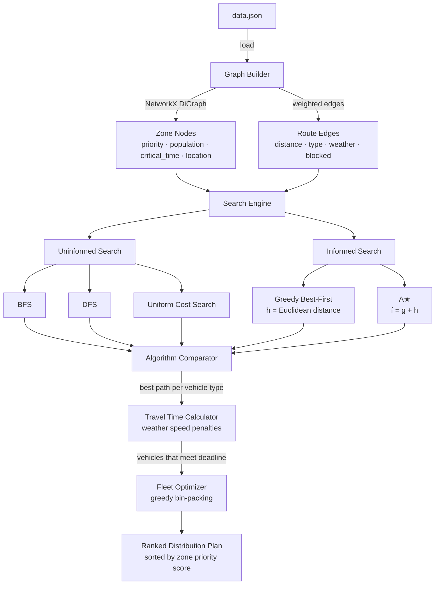
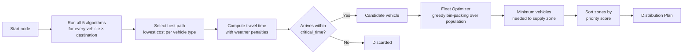

# Emergency Supply Distribution System

> An AI-powered route planning and fleet optimization engine for emergency humanitarian logistics — built in Python using a directed graph model of Portugal, five classical search algorithms, stochastic weather simulation, and a priority-aware vehicle dispatch optimizer.

---

## Overview

This project simulates an **emergency supply distribution system** for disaster relief scenarios. Given a network of Portuguese cities connected by road and air routes, the system determines the fastest viable paths for a heterogeneous fleet of vehicles and computes the optimal combination of vehicles needed to supply affected populations within their critical time windows.

The core challenge is multi-objective: routes must respect vehicle range limits, avoid blocked or weather-disrupted edges, meet per-zone delivery deadlines, and collectively cover zone populations with minimum fleet size.

---

## Problem Domain

The scenario models a real emergency response problem:

- **20 zones** across Portugal (mainland + Madeira + Açores), each with a population, a priority level, and a critical delivery deadline
- **Connections** between zones over road and air routes, with randomized weather conditions that affect speed and availability
- **4 vehicle types** with distinct capacities, ranges, and speeds — trucks are restricted to road routes
- The system must identify, for each destination, which vehicles can arrive in time and how many of each are needed to supply the zone's entire population

---

## Architecture



---

## Search Algorithms

All five algorithms share a common interface: they receive the graph, a start node, a goal node, and the vehicle fleet, and return the best path and its total distance cost per vehicle type. Each algorithm respects:

- **Range constraints** — a vehicle cannot traverse an edge longer than its maximum range
- **Route type constraints** — trucks are restricted to road edges
- **Blocked edges** — edges blocked by weather are skipped entirely

| Algorithm | Strategy | Optimal? | Complete? |
|---|---|---|---|
| **BFS** | FIFO queue, explores level by level | Yes (unweighted) | Yes |
| **DFS** | LIFO stack, explores depth-first | No | No (cycles) |
| **Uniform Cost Search** | Min-heap on cumulative distance `g` | Yes | Yes |
| **Greedy Best-First** | Min-heap on Euclidean heuristic `h` | No | Yes |
| **A\*** | Min-heap on `f = g + h` (Euclidean) | Yes | Yes |

The **heuristic** used by Greedy and A\* is the straight-line Euclidean distance between node coordinates, which is admissible for this domain since actual route distances are always ≥ straight-line distances.

---

## Weather & Blocking Model

Each edge in the graph is assigned a weather condition at graph construction time, drawn from a weighted probability distribution:

| Condition | Probability | Effect |
|---|---|---|
| Sun | 24% | No impact |
| Rain | 24% | −40% vehicle speed |
| Snow | 24% | −60% vehicle speed |
| Wind | 24% | −10% vehicle speed |
| Storm | 4% | Edge **blocked** entirely |

Road edges also have a 5% chance of random blockage under any non-sunny condition. Air edges are never blocked except during storms.

---

## Vehicle Fleet

| Type | Capacity (people) | Range (km/edge) | Speed (km/h) | Air routes |
|---|---|---|---|---|
| Drone | 15 | 100 | 200 | Yes |
| Truck | 5 000 | 150 | 70 | No |
| Helicopter | 1 000 | 140 | 400 | Yes |
| Airplane | 10 000 | 3 000 | 700 | Yes |

Travel time is computed per edge as `distance / (speed × weather_factor)` and compared against the destination zone's `critical_time` to determine which vehicles arrive in time.

---

## Supply Distribution Pipeline

When option **7 — Supply Distribution** is selected, the system runs the full pipeline:



**Zone priority score** is a weighted composite that balances urgency and scale:

```
priority_score = 0.7 × zone_priority + 0.3 × (zone_population / max_population)
```

Zones are served in descending priority score order, ensuring the most critical and populous areas receive supplies first.

**Fleet optimization** uses a greedy bin-packing approach: vehicles are sorted by capacity in descending order and added until total capacity covers the zone's population. A final adjustment selects the smallest vehicle that covers any remaining gap without exceeding it.

---

## Project Structure

```
.
├── Main.py                    # Interactive CLI menu — entry point
├── data.json                  # Zone definitions, connections, and vehicle specs
│
├── Models/
│   ├── graph.py               # NetworkX DiGraph builder with weather simulation
│   ├── vehicle.py             # Travel time, deadline check, fleet optimizer
│   └── zone.py                # Zone queries and priority score calculator
│
├── Algorithms/
│   ├── uninformed.py          # BFS, DFS, Uniform Cost Search
│   ├── informed.py            # Greedy Best-First, A*
│   ├── heuristics.py          # Euclidean distance heuristic
│   └── compare.py             # Multi-algorithm comparator with zone ranking
│
└── Utils/
    ├── data_loader.py         # JSON → graph data parser
    └── visualizer.py          # NetworkX + Matplotlib graph renderer
```

---

## Prerequisites

- Python 3.10+
- Install dependencies:

```bash
pip install networkx matplotlib
```

---

## Running the System

```bash
python Main.py
```

The system loads `data.json`, builds the graph (with freshly randomized weather per run), and presents an interactive menu:

```
Menu de Opções:
1. Visualizar o grafo
2. Procura em Largura (BFS)
3. Procura em Profundidade (DFS)
4. Procura com Custo Uniforme
5. Procura Greedy
6. Procura com A*
7. Distribuição de mantimentos
8. Sair
```

Options 2–6 prompt for a start and goal node and display the best path and cost for each vehicle type. Option 7 runs the full supply distribution pipeline across all destinations, ranked by zone priority.

### Example — A\* search

```
Procura com A*:
Escreva o nó inicial: Lisboa
Escreva o nó final: Porto
Veículo drone    | Caminho encontrado: Lisboa -> Leiria -> Coimbra -> Aveiro -> Porto | Custo: 430
Veículo camião   | Caminho encontrado: Lisboa -> Leiria -> Coimbra -> Aveiro -> Porto | Custo: 430
Veículo helicóptero | Caminho encontrado: Lisboa -> Leiria -> Coimbra -> Aveiro -> Porto | Custo: 430
Veículo avião    | Caminho encontrado: Lisboa -> Leiria -> Coimbra -> Aveiro -> Porto | Custo: 430
```

### Example — Supply distribution

```
Distribuição de mantimentos:
Escreva o nó inicial: Lisboa

Melhores caminhos para a cidade Leiria:
  Veículo: drone      | Caminho: Lisboa -> Leiria | Custo: 145
    O veículo drone chega a tempo em 43 minutos
  Veículo: camião     | Caminho: Lisboa -> Leiria | Custo: 145
    O veículo camião chega a tempo em 124 minutos
Veículos usados para ir para Leiria: 1 x camião, 10 x drone
```

---

## Graph Visualization

Option 1 renders the full graph using NetworkX and Matplotlib, with edge labels showing distance, connection type, weather condition, and blockage status.

---

## Author

Developed by **Gonçalo Oliveira Cruz** as part of the **Artificial Intelligence** course at the [University of Minho](https://www.uminho.pt/), academic year 2024/25.